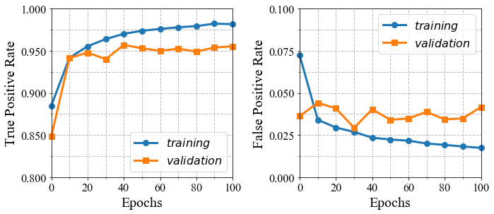

# NetIDS

## Table Of Contents

- [Description](#description)
- [Preparation](#preparation)
- [Files](#files)
- [Usage](#usage)

## Description

NetIDS is a simple and handy module providing a basic concept for a machine-learning-based Network Intrusion Detection System (NIDS). This example codes can be very helpful if you're looking for integration with the inspection engines or APIs.

---
## Preparation

### Installing prerequisites

To install the prerequisite, simply type in the shell prompt the following:

```
$ pip install -r requirements.txt
```

You can use TensorFlow libraries with GPU support (See the guide at [TensorFlow tutorials](https://www.tensorflow.org/guide/gpu?hl=en)) to accelerate your code with CUDA back-end.

### Dataset

The `dataset/flow_data.csv` offers a feature set made up of a variety of network flow-statistical information. About 95,000 traffic flows were used to produce such a dataset. The complete list of features can be found in [another repository of mine](https://github.com/Cvilian/NetFI).

We've done labeling traffic samples beforehand via a free online malware scanner named [Virustotal](https://www.virustotal.com/gui/) as you can just directly input the feature set and get the model to work. Please refer to the [developer guide](https://developers.virustotal.com/v3.0/reference#overview) to elaborate on how to utilize Virustotal API for the labeling.

If you wanna see how the raw data looks like, go to [Malware-Traffic-Analysis.net](https://www.malware-traffic-analysis.net/) to download the packet traces.

---
## Files

* `data.py`: Data provider. 
* `model.py`: Implementations of a very simple binary classifier (Malicious/Normal Traffic).
* `utils.py`: A bunch of utility functions for labeling and visualization.

---
## Usage

* Read the csv to load the dataset.

```
>>> import data
>>> D = data.NetData()
>>> x, y = D.getInput()
```
</br>

* Build a classifier and feed the prepared dataset to it.

```
>>> import model
>>> M = model.Model()
>>> M.train(x, y)
```

</br></br>

* Plotting the change in the True Positive Rate (or Detection Rate) and False Positive Rate over the epochs.

```
>>> import utils
>>> utils.visualize_performance(M.res)
```

</br></br>

* You may want to take a look at the underlying data structure, so we provided a utility function ([t-SNE](https://en.wikipedia.org/wiki/T-distributed_stochastic_neighbor_embedding)) used to display a 2D projection for visualization from the original dataset.

```
>>> utils.visualize_tsne(x, y)
```


